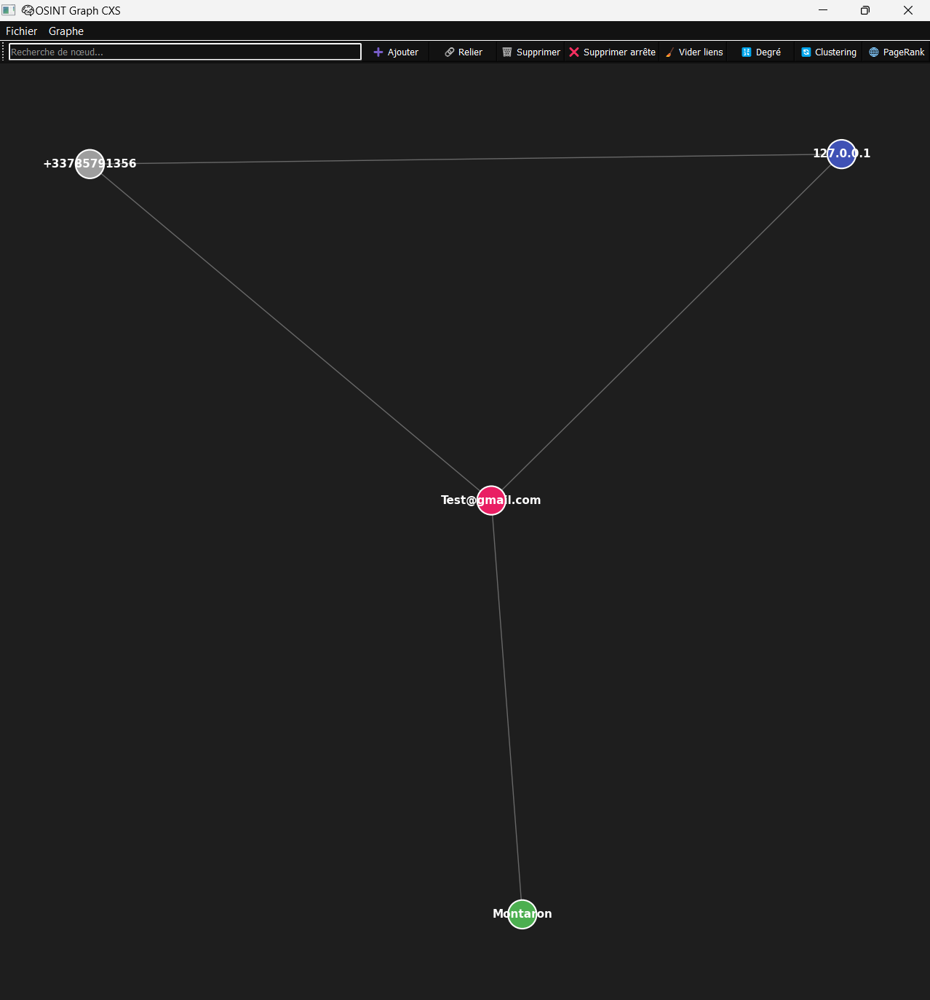

# 🧠 OSINT Graph CXS
<p align="center">
   
OSINT Graph CXS est une application interactive de visualisation et d'analyse de graphes pour l'OSINT (Open Source Intelligence). Elle permet de créer, manipuler et analyser des graphes de relations entre des éléments comme des emails, des IPs, des noms, etc., grâce à une interface graphique construite avec **PyQt5** et **NetworkX**.

## Caractéristiques principales

🔍 **Visualisation interactive de graphes**  
```Visualisez facilement des relations entre différents objets avec une interface fluide et interactive.```

🌆 **Filtrage par type de nœud**  
```Affinez votre analyse en filtrant les nœuds par leur type, comme "email", "IP", "nom", etc.```

⚙️ **Zoom et navigation fluide**  
```Utilisez la molette de la souris pour zoomer sur les graphes et explorer en détail les relations.```

⏳ **Calculs d'analyses avancées**  
```Effectuez des analyses sur votre graphe comme le calcul du degré, du coefficient de clustering et du PageRank.```

🛠️ **Gestion dynamique des nœuds et des arêtes**  
```Ajoutez, reliez, et supprimez facilement des nœuds et des arêtes grâce à une interface simple.```

📊 **Exportation et importation de données**  
```Importez des graphes à partir de fichiers CSV et exportez-les facilement. Sauvegardez vos graphes en JSON.```

🔄 **Changement de disposition du graphe**  
```Choisissez parmi différentes dispositions (Spring, Circular, Spectral) pour mieux visualiser les relations.```

⏱️ **Recherche rapide dans le graphe**  
```Trouvez rapidement des nœuds dans le graphe en utilisant la barre de recherche dynamique.```

## Installation


